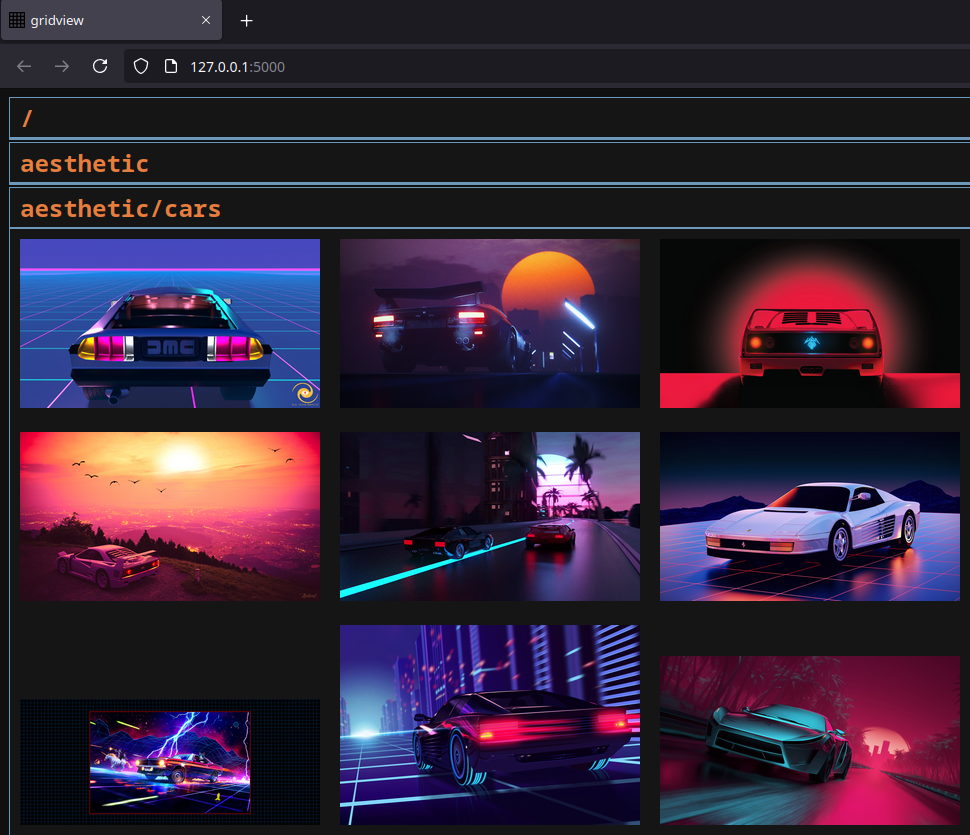

# gridview - grid image viewer

[](http://www.python.org/download/)



# Installation
```
./setup-env.sh
./install.sh
```

## Requirements - pip
* flask

# Running
```
gridview        # inside the dir you want to view media files
```
